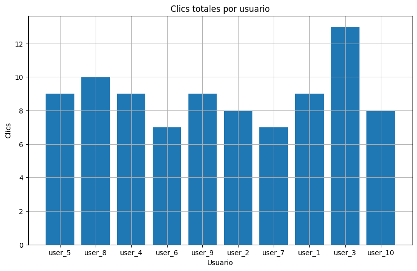

<html lang="es">
<head>
    <meta charset="UTF-8">
    <meta name="viewport" content="width=device-width, initial-scale=1.0">
    <title>Análisis de Flujo de Datos con Spark</title>
    
</head>
<body>
    <header>
        

        <h1>📊 Análisis de Flujo de Datos</h1>
        <h2>Hecho por: Pablo Roncancio</h2>
        

            Apache Spark
            Python
            Jekyll
        

    </header>

    

        

            <h2 class="section-title">
                
🎯

                Objetivo
            </h2>
            

                Aplicar <strong>analítica avanzada</strong> para procesar un flujo de datos simulado en un contexto empresarial usando <strong>Python</strong> y <strong>Spark</strong>, demostrando el poder del procesamiento distribuido y el análisis en tiempo real.
            

        

        

            <h2 class="section-title">
                
🛒

                Escenario: Tienda Online
            </h2>
            
            

                <h3>Imaginemos una tienda online que desea analizar en tiempo real los clics de los usuarios</h3>
                <ul>
                    <li>Detectar patrones de navegación</li>
                    <li>Medir el nivel de interés de los clientes</li>
                    <li>Optimizar campañas publicitarias</li>
                    <li>Mejorar recomendaciones de productos</li>
                </ul>
            

            <h3 style="font-size: 1.8em; margin: 40px 0 20px 0; color: #0f9b0f;">📋 Estructura del Dataset</h3>
            
            <table class="data-table">
                <thead>
                    <tr>
                        <th>Campo</th>
                        <th>Descripción</th>
                    </tr>
                </thead>
                <tbody>
                    <tr>
                        <td><strong>Timestamp</strong></td>
                        <td>Fecha y hora del clic</td>
                    </tr>
                    <tr>
                        <td><strong>User_ID</strong></td>
                        <td>Identificador único del usuario</td>
                    </tr>
                    <tr>
                        <td><strong>Clicks</strong></td>
                        <td>Número de clics en esa franja temporal</td>
                    </tr>
                </tbody>
            </table>

            

                📊 Total de registros: 1000 clics simulados
            

        

        

            <h2 class="section-title">
                
⚙️

                Implementación con Spark
            </h2>

            <h3 style="font-size: 1.8em; margin: 30px 0 20px 0; color: #0f9b0f;">1️⃣ Configuración del Entorno</h3>
            

                Se instaló <strong>Apache Spark 3.5.0</strong> en Google Colab y se configuró el entorno de ejecución.
            

            

                <code>
from pyspark.sql import SparkSession

spark = SparkSession.builder.appName("ClickstreamAnalysis").getOrCreate()
print("Versión de Spark:", spark.version)
                </code>
            

            <h3 style="font-size: 1.8em; margin: 40px 0 20px 0; color: #0f9b0f;">2️⃣ Carga y Exploración de Datos</h3>

            

                <code>
df = spark.read.csv("clickstream_data.csv", header=True, inferSchema=True)
df.show(5)
                </code>
            

            

                <strong style="font-size: 1.2em;">✅ Ventaja:</strong> Spark permite procesar datasets que no cabrían en memoria usando un solo equipo.
            

            <h3 style="font-size: 1.8em; margin: 40px 0 20px 0; color: #0f9b0f;">3️⃣ Procesamiento del Flujo</h3>

            

                <code>
from pyspark.sql.functions import window, col, sum

clicks_per_user = df.groupBy("User_ID").agg(sum("Clicks").alias("Total_Clicks"))
clicks_per_user.show()
                </code>
            

        

        

            <h2 class="section-title">
                
💡

                Interpretación Analítica
            </h2>

            

                

                    <h3>👥 Usuarios Activos</h3>
                    
Algunos usuarios presentan <strong>clics significativamente mayores</strong>, indicando:

                    <ul style="margin-top: 15px; line-height: 1.8; color: #555;">
                        <li>• Mayor interacción con productos</li>
                        <li>• Usuarios recurrentes o fieles</li>
                        <li>• Oportunidad para marketing personalizado</li>
                    </ul>
                

                

                    <h3 style="color: #1976d2;">🎯 Usuarios Pasivos</h3>
                    
Los usuarios con <strong>poca actividad</strong> representan:

                    <ul style="margin-top: 15px; line-height: 1.8; color: #555;">
                        <li>• Visitantes ocasionales</li>
                        <li>• Clientes potenciales</li>
                        <li>• Necesidad de incentivos para conversión</li>
                    </ul>
                

            

        

        

            <h2 class="section-title">
                
🏗️

                Arquitectura del Proyecto
            </h2>

            

                

                    <h3>Google Colab + PySpark</h3>
                    
Procesamiento y Visualización

                

                
↓

                

                    <h3>Jekyll</h3>
                    
Generación del Blog Estático

                

                
↓

                

                    <h3>GitHub Pages</h3>
                    
Alojamiento en la Nube (Gratuito)

                

            

        

        

            <h2 class="section-title">
                
📈

                Visualización de Resultados
            </h2>

            

                
                
Figura: Gráfico de clics

            

        

        

            <h2 class="section-title">
                
⚡

                Streaming vs Procesamiento por Lotes
            </h2>

            

                

                    <h3>📦 Procesamiento por Lotes</h3>
                    <ul>
                        <li>Analiza datos acumulados y almacenados</li>
                        <li>Mayor latencia</li>
                        <li>Procesamiento periódico</li>
                        <li><strong>Ejemplo:</strong> Análisis de ventas diarias</li>
                    </ul>
                

                

                    <h3>⚡ Procesamiento en Streaming</h3>
                    <ul>
                        <li>Analiza datos en tiempo real</li>
                        <li>Baja latencia y decisiones inmediatas</li>
                        <li>Procesamiento continuo</li>
                        <li><strong>Ejemplo:</strong> Monitoreo de clics por segundo</li>
                    </ul>
                

            

            

                <strong>✨ Insight 2025:</strong>
                

                    El streaming permite detectar comportamientos instantáneos, esencial para empresas que buscan reaccionar de forma ágil ante sus clientes.
                

            

        

        

            

                <h3>🎓 Conclusión</h3>
                

                    Este ejercicio permitió aplicar <strong>analítica avanzada con Spark</strong>, demostrando cómo el procesamiento en streaming puede aportar <strong>valor inmediato</strong> a un negocio digital.
                

                

                    El uso de herramientas como <strong>Spark</strong>, <strong>Python</strong> y <strong>Jekyll</strong> facilita la integración de la analítica con la publicación de resultados en la web.
                

            

        

    

    <footer>
        
© 2025 - Blog de <strong>Pablo Roncancio</strong>

        
Construido con ❤️ usando Spark, Python y Jekyll

    </footer>

    
</body>
</html>
